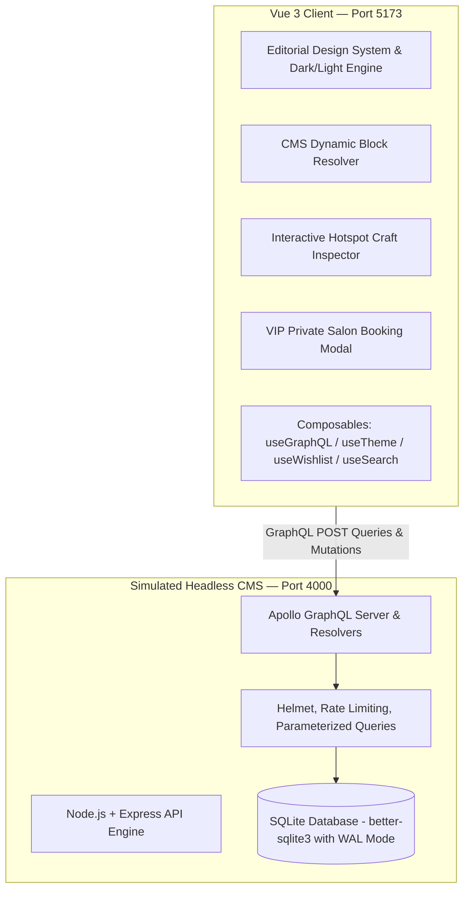
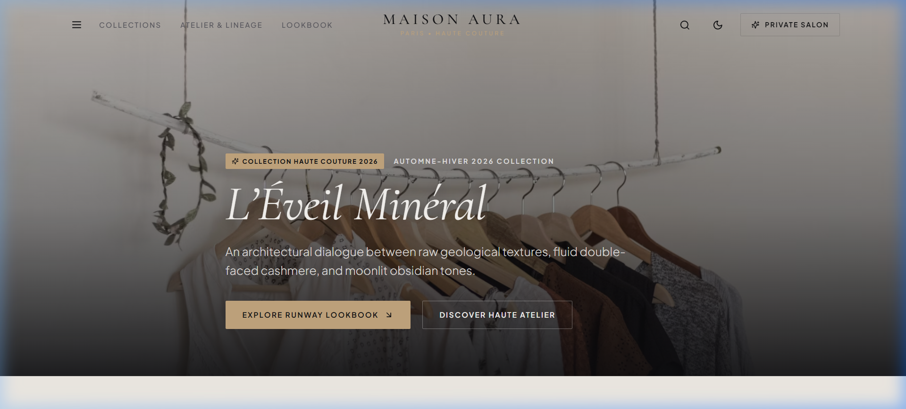
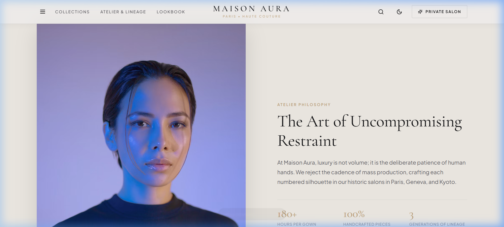
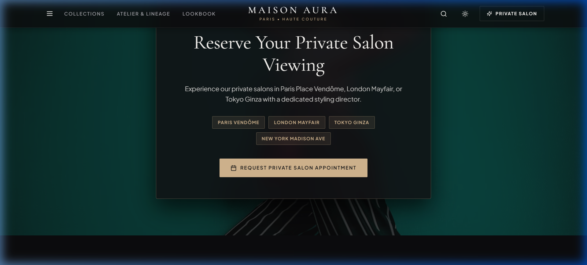
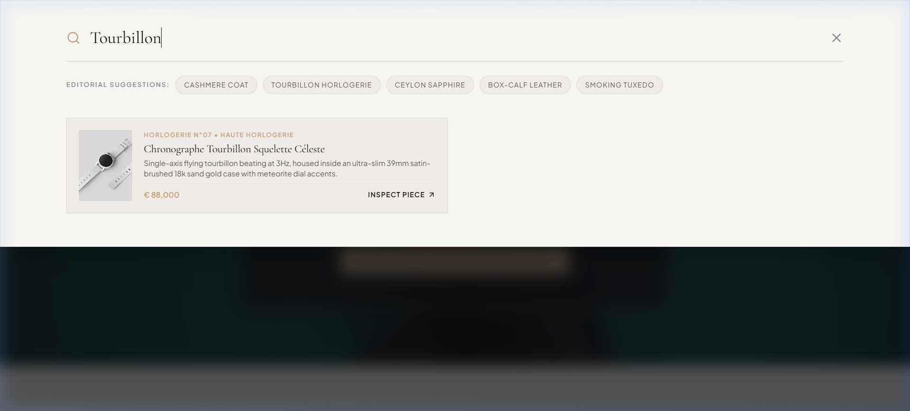
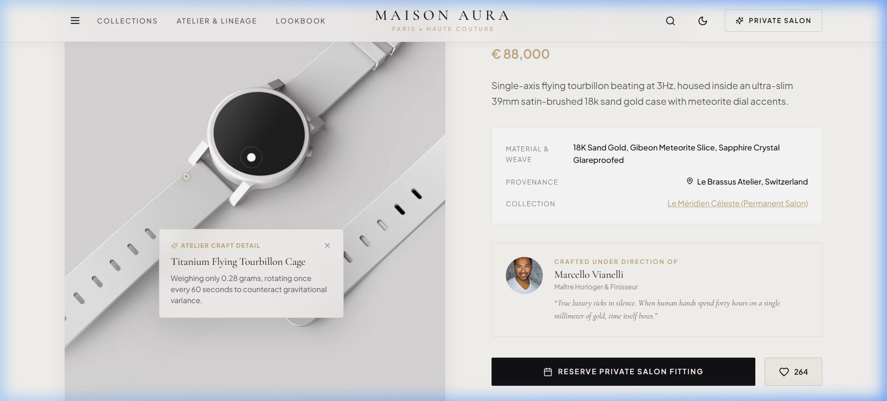

# MAISON AURA — Digital Atelier & Haute Horlogerie

> **An Enterprise Demonstration of Vue 3 consuming a Headless CMS via GraphQL with a Node.js + SQLite Backend.**

[](https://vuejs.org/)
[](https://graphql.org/)
[](https://vitejs.dev/)
[](https://www.sqlite.org/)
[](https://nodejs.org/)

---

## ✦ Table of Contents
1. [Overview & Real-Life Scenario](#-overview--real-life-scenario)
2. [Architecture & Data Flow](#-architecture--data-flow)
3. [Frontend Architecture Guide](docs/frontend_architecture.md)
4. [Visual Showcase & Screenshots](#-visual-showcase--screenshots)
5. [Headless CMS & GraphQL Specifications](#-headless-cms--graphql-specifications)
6. [Frontend Component Architecture](#-frontend-component-architecture)
7. [Security & Enterprise Best Practices](#-security--enterprise-best-practices)
8. [Project Directory Structure](#-project-directory-structure)
9. [Getting Started & Local Development](#-getting-started--local-development)

---

## ✦ Overview & Real-Life Scenario

Modern luxury fashion houses, haute horlogerie maisons, and high-end digital publications (*Bottega Veneta, Jacquemus, Celine, Aesop, Rimowa*) require decoupled **Headless CMS architectures**. 

**Maison Aura** demonstrates how editorial and marketing teams manage structured content, dynamic page blocks, seasonal lookbooks, and artisan lineages in a Headless CMS, while a **Vue 3** frontend consumes the content over **GraphQL** with micro-interactions, dark/light theme switching, interactive garment hotspot inspection, and live client booking mutations.

### Key Capabilities:
- **Dynamic Polymorphic Page Builder**: The landing page structure is completely CMS-driven via dynamic content blocks (`HeroEditorialBlock`, `CraftStoryBlock`, `LookbookGridBlock`, `CuratedReelBlock`, `BespokeInquiryBlock`).
- **Interactive Hotspot Craftsmanship Viewer**: Garment and watch photography with clickable golden radiant pins revealing tailoring details, material compositions, and artisan techniques.
- **Real-Time GraphQL Search**: Debounced full-text search across materials (*Cashmere, Tourbillon, Saphir, Box-Calf*), look numbers, and categories.
- **Interactive GraphQL Mutations**:
  - `requestPrivateViewing`: Client consultation and VIP private salon booking with validation.
  - `toggleLookWishlist`: Optimistic client lookbook piece saving and live like counters.
- **Editorial Design System**: Typography pairing (*Cormorant Garamond* + *Plus Jakarta Sans*), Alabaster Light (`#FAF8F5`) and Obsidian Dark Runway (`#0C0C0E`) modes.

---

## ✦ Architecture & Data Flow



---

## ✦ Visual Showcase & Screenshots

### 1. Hero Editorial Campaign (Alabaster Light Mode)
Fullscreen atmospheric backdrop, typography pairing, seasonal badge, and smooth navigation.


---

### 2. Craft Story Block & Provenance Metrics
Dynamic CMS block displaying pull-quotes, artisan portrait, and handcrafted statistics.


---

### 3. Night Runway Mode (Obsidian Dark Theme)
Sleek dark mode transition preserving high contrast and warm champagne gold accents.


---

### 4. Real-Time GraphQL Search Drawer
Debounced instant search querying the Headless CMS GraphQL schema with discovery pills.


---

### 5. Interactive Hotspot Craftsmanship Inspector
Clickable golden radiant pins revealing tailoring techniques and material compositions.


---

## ✦ Headless CMS & GraphQL Specifications

### GraphQL Types & Schema Highlights
```graphql
type Collection {
  id: ID!
  title: String!
  subtitle: String
  slug: String!
  season: String!
  year: Int!
  description: String
  hero_image: String!
  theme_color: String
  is_featured: Boolean!
  lookbook_items: [LookbookItem!]!
}

type LookbookItem {
  id: ID!
  title: String!
  look_number: String!
  category: String!
  description: String!
  image_url: String!
  secondary_image_url: String
  material: String!
  origin: String!
  price_display: String!
  hotspots: [Hotspot!]!
  is_exclusive: Boolean!
  likes_count: Int!
  collection: Collection
  artisan: Artisan
}

type CMSBlock {
  id: ID!
  block_type: String!
  sort_order: Int!
  title: String
  subtitle: String
  body_content: String
  media_url: String
  config_json: String
}

type Query {
  cmsPage(slug: String!): CMSPage
  collections(featuredOnly: Boolean): [Collection!]!
  collectionBySlug(slug: String!): Collection
  lookbookItems(collectionSlug: String, category: String, limit: Int): [LookbookItem!]!
  lookbookItem(id: ID!): LookbookItem
  artisans: [Artisan!]!
  searchAll(query: String!): [LookbookItem!]!
}

type Mutation {
  requestPrivateViewing(input: VIPViewingInput!): VIPBookingResult!
  toggleLookWishlist(lookId: ID!, sessionId: String!): ToggleWishlistResult!
  subscribeEditorial(email: String!): Boolean!
}
```

---

## ✦ Frontend Component Architecture

```
frontend/src/
├── components/
│   ├── cms/                   # Dynamic Polymorphic CMS Blocks
│   │   ├── BlockRenderer.vue  # Maps CMS block types to Vue components
│   │   ├── HeroEditorialBlock.vue
│   │   ├── CraftStoryBlock.vue
│   │   ├── LookbookGridBlock.vue
│   │   ├── CuratedReelBlock.vue
│   │   └── BespokeInquiryBlock.vue
│   └── ui/                    # Reusable UI Primitives
│       ├── Navbar.vue         # Floating header with theme toggle & search
│       ├── Footer.vue         # Luxury footer with newsletter subscription
│       ├── LookCard.vue       # Look item card with wishlist action & zoom
│       ├── HotspotViewer.vue  # Interactive garment/craft inspector
│       ├── VIPBookingModal.vue# GraphQL mutation booking modal
│       ├── SearchDrawer.vue   # Debounced search drawer
│       └── BaseButton.vue     # Reusable button supporting router-link
├── composables/
│   ├── useGraphQL.js          # Reactive GraphQL query/mutation client + cache
│   ├── useTheme.js            # Light/Dark mode state management
│   └── useWishlist.js         # Client wishlist with optimistic updates
└── views/
    ├── HomeView.vue           # Dynamic landing page powered by CMS blocks
    ├── CollectionsView.vue    # Seasonal gallery with taxonomy filters
    ├── LookDetailView.vue     # Detailed piece view + hotspot inspection
    ├── ArtisansView.vue       # Master craftsmen monograph
    └── NotFoundView.vue       # 404 luxury page
```

---

## ✦ Security & Enterprise Best Practices

1. **SQL Injection Prevention**: All SQLite queries use parameterized prepared statements via `better-sqlite3`.
2. **GraphQL Protection**: Rate-limiting applied via `express-rate-limit` for queries (300/15min) and tighter limits on mutations (50/hour).
3. **Security Headers & CORS**: Configured with `helmet` and strict origin policies for the Vite client (`http://localhost:5173`).
4. **Input Validation**: Mutations validate email formats, mandatory fields, and sanitize strings before database ingestion.
5. **Optimistic UI Updates**: Client-side state updates optimistically with rollback on GraphQL mutation failure.

---

## ✦ Project Directory Structure

```
Vue3Demonstration/
├── backend/                        # Headless CMS GraphQL Server
│   ├── src/
│   │   ├── db/
│   │   │   ├── database.js         # SQLite connection & schema initialization
│   │   │   └── seed.js             # High-fashion editorial seed data
│   │   ├── graphql/
│   │   │   ├── typeDefs.js         # GraphQL Schema definitions
│   │   │   └── resolvers.js        # Query & Mutation resolvers
│   │   ├── middleware/
│   │   │   └── security.js         # Helmet & rate limiter configurations
│   │   ├── test_graphql.js         # Automated mutation test script
│   │   └── index.js                # Server entry point (:4000)
│   └── package.json
│
├── frontend/                       # Vue 3 Client Application
│   ├── src/
│   │   ├── assets/styles/          # Editorial design tokens & reset
│   │   ├── components/             # CMS blocks & UI components
│   │   ├── composables/            # useGraphQL, useTheme, useWishlist
│   │   ├── graphql/                # Query & Mutation documents
│   │   ├── router/                 # Vue Router configuration
│   │   ├── views/                  # Page views
│   │   ├── App.vue                 # App root
│   │   └── main.js                 # App entry point
│   ├── index.html
│   ├── vite.config.js
│   └── package.json
│
├── docs/
│   └── screenshots/                # Showcase screenshot assets
├── .gitignore
├── package.json                    # Root orchestrator script
└── README.md
```

---

## ✦ Getting Started & Local Development

### Prerequisites
- **Node.js**: `v18.0.0` or higher (tested on `v22.18.0`)
- **npm**: `v9.0.0` or higher

### Installation & Launch

```bash
# 1. Clone or navigate to the project directory
cd Vue3Demonstration

# 2. Install all dependencies across root, backend, and frontend
npm run install:all

# 3. Seed the SQLite database with luxury editorial data
npm run seed

# 4. Start both the Backend (:4000) and Frontend (:5173) simultaneously
npm run dev
```

### Live URLs & Endpoints
* **Frontend Application**: [http://localhost:5173/](http://localhost:5173/)
* **GraphQL Endpoint & Apollo Sandbox**: [http://localhost:4000/graphql](http://localhost:4000/graphql)
* **Backend Health Check**: [http://localhost:4000/health](http://localhost:4000/health)

---

## ✦ License
This project is open source and available under the [MIT License](LICENSE).
