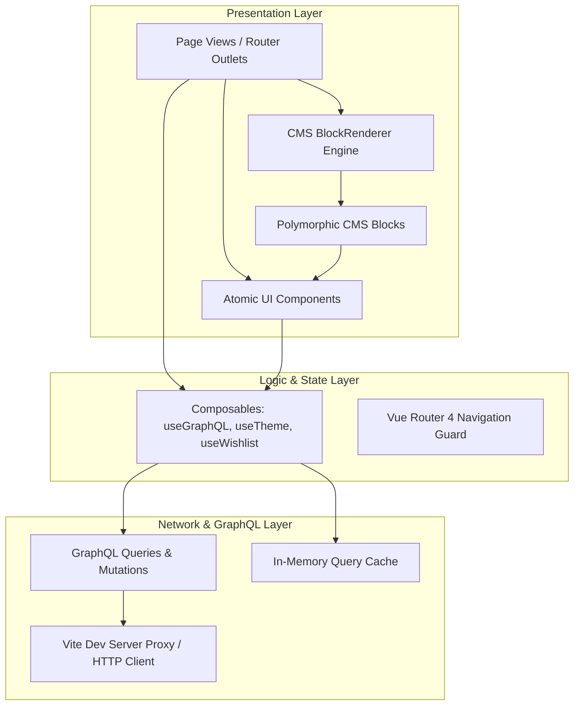
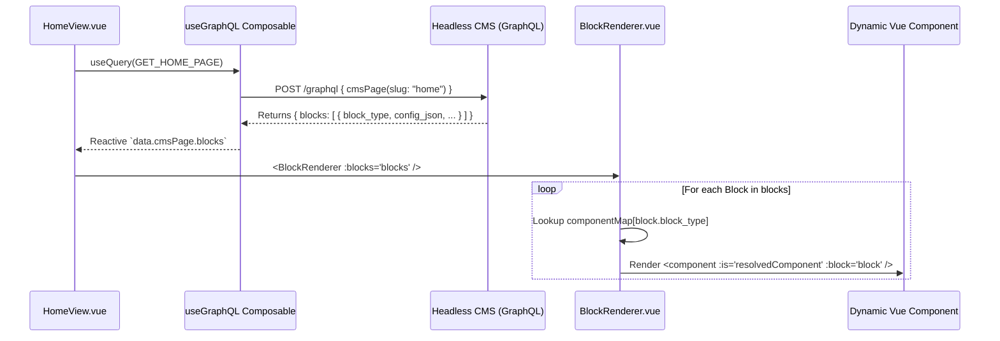

# Frontend Architecture & Project Organization Guide

> **Maison Aura — Luxury Editorial Headless CMS Client (Vue 3 + GraphQL)**

This document provides a comprehensive technical breakdown of the frontend architecture, design patterns, directory organization, dynamic CMS rendering mechanisms, and state management strategies implemented in the Maison Aura platform.

---

## 1. Architectural Philosophy & Core Principles

The frontend is architected as a **decoupled, modular, and component-driven Single Page Application (SPA)** built with **Vue 3 (Composition API)** and **Vite**.



### Key Architectural Pillars:
1. **Decoupled Headless Consumption**: The frontend contains zero hardcoded business data; all pages, collections, craft stories, and layouts are queried dynamically via GraphQL.
2. **Polymorphic Component Architecture**: Content models defined in the Headless CMS are dynamically resolved into Vue 3 components at runtime.
3. **Pure Composition API (`<script setup>`)**: Standardized reactivity using Vue 3 primitives (`ref`, `computed`, `watch`, `onMounted`) without legacy Options API overhead.
4. **Zero-Runtime CSS Design Tokens**: Custom vanilla CSS design system powered by CSS Custom Properties (Variables) enabling instant dark/light theme switching with zero runtime CSS-in-JS performance penalty.

---

## 2. Directory Structure & Module Breakdown

```
frontend/src/
├── assets/
│   └── styles/
│       ├── reset.css              # Universal modern CSS reset
│       └── main.css               # Design system tokens, typography, surfaces & animations
│
├── components/
│   ├── cms/                       # Dynamic Polymorphic CMS Block Components
│   │   ├── BlockRenderer.vue      # Dynamic component mapper & block orchestrator
│   │   ├── HeroEditorialBlock.vue # Fullscreen atmospheric campaign cover with CTA
│   │   ├── CraftStoryBlock.vue    # Split narrative with pull-quotes & craft statistics
│   │   ├── LookbookGridBlock.vue  # Asymmetrical editorial grid querying lookbook pieces
│   │   ├── CuratedReelBlock.vue   # Master artisans directory & studio lineage
│   │   └── BespokeInquiryBlock.vue# VIP consultation RSVP invitation block
│   │
│   └── ui/                        # Reusable Presentation Primitives
│       ├── Navbar.vue             # Floating glassmorphic header with search & theme switch
│       ├── Footer.vue             # Editorial footer with newsletter mutation & salons
│       ├── LookCard.vue           # Editorial look card with hover zoom & wishlist toggle
│       ├── HotspotViewer.vue      # Interactive garment/craftsmanship coordinate inspector
│       ├── VIPBookingModal.vue    # GraphQL mutation modal for salon appointment bookings
│       ├── SearchDrawer.vue       # Real-time debounced GraphQL search overlay
│       └── BaseButton.vue         # Polymorphic button (RouterLink, external anchor, button)
│
├── composables/                   # Encapsulated Business Logic & State
│   ├── useGraphQL.js              # Generic query/mutation executor with in-memory cache
│   ├── useTheme.js                # Alabaster Light / Obsidian Dark theme engine
│   └── useWishlist.js             # Client lookbook saves with optimistic UI updates
│
├── graphql/                       # GraphQL Document Definitions
│   ├── queries.js                 # Exported GraphQL query strings
│   └── mutations.js               # Exported GraphQL mutation strings
│
├── router/
│   └── index.js                   # Route definitions, route meta, and scroll restoration
│
├── views/                         # Route-Level Smart Views
│   ├── HomeView.vue               # CMS-driven dynamic landing page
│   ├── CollectionsView.vue        # Filterable seasonal archive & taxonomy browser
│   ├── LookDetailView.vue         # Deep look inspection with HotspotViewer & artisan bio
│   ├── ArtisansView.vue           # Master craftsmen monograph & atelier directory
│   └── NotFoundView.vue           # Luxury 404 error page
│
├── App.vue                        # Root application shell with layout & modal orchestration
└── main.js                        # App initialization & plugin mounting
```

---

## 3. Dynamic CMS Polymorphic Component Engine

One of the most powerful features of enterprise Headless CMS architectures (Contentful, Strapi, Sanity) is **Component-Based Content Modeling**. The page structure is not hardcoded in templates; rather, the CMS returns an ordered array of polymorphic blocks.

### Component Mapping Workflow



### Implementation in `BlockRenderer.vue`
```vue
<script setup>
import { computed } from 'vue';
import HeroEditorialBlock from './HeroEditorialBlock.vue';
import CraftStoryBlock from './CraftStoryBlock.vue';
import LookbookGridBlock from './LookbookGridBlock.vue';
import CuratedReelBlock from './CuratedReelBlock.vue';
import BespokeInquiryBlock from './BespokeInquiryBlock.vue';

const props = defineProps({
  blocks: { type: Array, default: () => [] }
});

defineEmits(['open-booking']);

// Dynamic registry mapping CMS block strings to Vue components
const componentMap = {
  HeroEditorialBlock,
  CraftStoryBlock,
  LookbookGridBlock,
  CuratedReelBlock,
  BespokeInquiryBlock
};

const sortedBlocks = computed(() => {
  return [...props.blocks].sort((a, b) => a.sort_order - b.sort_order);
});
</script>

<template>
  <div class="cms-page-blocks">
    <template v-for="block in sortedBlocks" :key="block.id">
      <component
        :is="componentMap[block.block_type]"
        v-if="componentMap[block.block_type]"
        :block="block"
        @open-booking="$emit('open-booking')"
      />
    </template>
  </div>
</template>
```

---

## 4. Composables & State Management

Instead of relying on heavy monolithic stores, business logic is organized into **focused, reusable Composables**:

### 1. `useGraphQL.js` (Query & Mutation Composable)
- **In-Memory Cache**: Repeated route transitions instantly load from cache while background validation occurs.
- **Reactive State**: Provides `data`, `loading`, `error`, and `refetch(variables)`.
- **Bypass Cache for Mutations**: Mutations automatically bypass cache to ensure up-to-date server state.

```javascript
// Example usage in any component:
const { data, loading, error, refetch } = useQuery(GET_COLLECTION_BY_SLUG, {
  slug: 'automne-hiver-2026'
});
```

### 2. `useWishlist.js` (Optimistic UI Updates)
- Implements **Optimistic Updates**: When a user clicks the wishlist heart, the local UI and counter update *immediately* for zero latency.
- If the GraphQL mutation fails over the network, the state rolls back automatically.
- Assigns and persists an anonymous client session token in `localStorage`.

### 3. `useTheme.js` (Theming Engine)
- Switches between `theme-alabaster` (Light) and `theme-obsidian` (Dark Runway).
- Persists user preference in `localStorage` and respects system OS preferences (`prefers-color-scheme`).

---

## 5. Interactive UI Patterns

### Interactive Hotspot Coordinate Inspector (`HotspotViewer.vue`)
Allows editorial images to contain interactive coordinate pins (`x`, `y` percentages):

```
       ┌──────────────────────────────────────────────┐
       │ Image Stage (Aspect Ratio 4/5)               │
       │                                              │
       │            ◎ (x: 48%, y: 28%)                │
       │            │ Hand-Rolled Lapel Pin           │
       │            ▼                                 │
       │     ┌────────────────────────┐               │
       │     │ ATELIER CRAFT DETAIL   │               │
       │     │ Hand-rolled lapel with │               │
       │     │ invisible stitching... │               │
       │     └────────────────────────┘               │
       │                                              │
       │                 ◎ (x: 52%, y: 64%)           │
       │                   Split-Seam Blind Stitch    │
       └──────────────────────────────────────────────┘
```

1. Pins are positioned absolutely using CSS `left: ${hp.x}%` and `top: ${hp.y}%`.
2. Radiant pulsating rings are animated with CSS keyframes.
3. Clicking a pin opens a glassmorphic popover with auto-clamping coordinates to prevent screen overflow.

---

## 6. Design System Tokens & Typography Scale

The design system is defined in `main.css` using CSS Custom Properties:

| Token Name | Light (Alabaster) | Dark (Obsidian) | Purpose |
| :--- | :--- | :--- | :--- |
| `--bg-primary` | `#FAF8F5` | `#0C0C0E` | Main page canvas |
| `--bg-secondary` | `#F3EFE9` | `#141418` | Section backgrounds & cards |
| `--text-primary` | `#121214` | `#FAF8F5` | Primary high-contrast copy |
| `--accent-gold` | `#C5A880` | `#D6B992` | Warm champagne gold accents |
| `--font-serif` | `'Cormorant Garamond', serif` | Titles, pull-quotes, wordmark |
| `--font-sans` | `'Plus Jakarta Sans', sans-serif`| UI buttons, labels, meta tags |

---

## 7. Performance & Enterprise Best Practices

1. **Native Lazy Loading**: All images use `loading="lazy"` to prevent network saturation.
2. **Debounced Search**: Search input queries are debounced by 250ms to prevent excessive GraphQL requests.
3. **Smooth View Transitions**: Page transitions use Vue `<transition name="page-fade" mode="out-in">`.
4. **Vite Proxy Engine**: The Vite development server automatically proxies `/graphql` requests to `http://localhost:4000`, preventing cross-origin issues in local development.
5. **Scroll Restoration**: Vue Router's `scrollBehavior` ensures the browser smoothly scrolls back to `(0, 0)` on route change.
